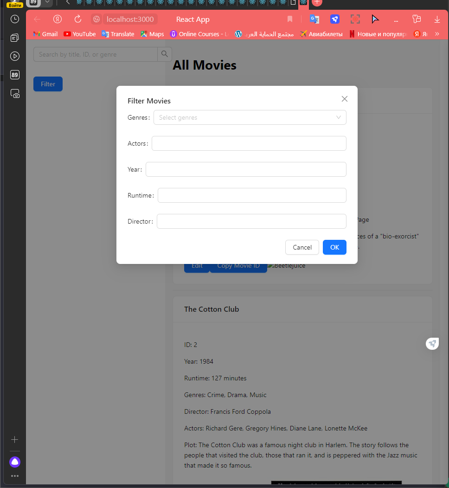
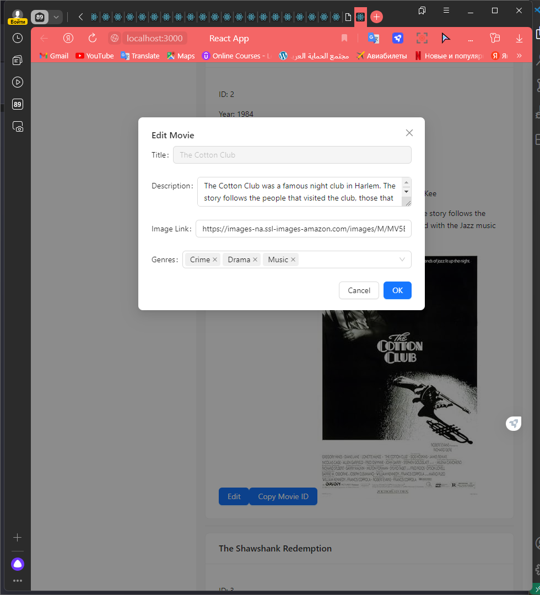

# React Movie Database App

This project is a simple movie database app built with React. It allows users to search, filter, and edit movie details.

## Table of Contents

- [Features](#features)
- [Getting Started](#getting-started)
  - [Prerequisites](#prerequisites)
  - [Installation](#installation)
- [Usage](#usage)
- [Screenshots](#screenshots)
- [Contributing](#contributing)
- [License](#license)

## Features

- Search movies by title, ID, or genre
- Filter movies based on various criteria
- Edit movie details
- Copy movie ID to the clipboard

## Getting Started

### Prerequisites

Make sure you have [Node.js](https://nodejs.org/) and [npm](https://www.npmjs.com/) installed on your machine.

### Installation

1. Clone the repository:

   ```bash
   git clone https://github.com/fathriAbanoub/react-movie-database.git
Navigate to the project folder:

bash

cd react-movie-database

Install dependencies:

bash

    npm install

Usage

    Start the development server:

    bash

npm start

Open your browser and go to http://localhost:3000.

Use the search bar, filter options, and edit buttons to interact with the movie database.

#Screenshots


Contributing

Contributions are welcome! If you find any bugs or have suggestions for improvements, please open an issue or create a pull request.